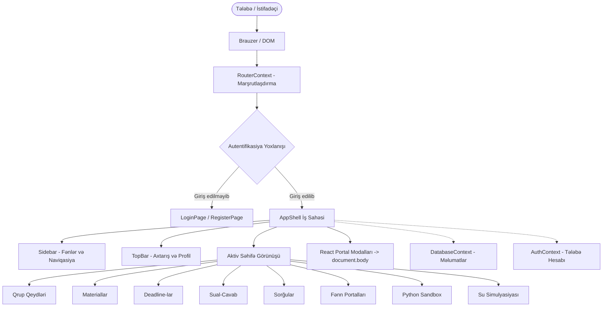

# AzTU 6326A2 — Proqram Təminatı Memarlığı (Architecture Guide)

Bu sənəd **AzTU 6326A2** akademik iş sahəsinin sistem arxitekturasını, komponent iyerarxiyasını, vəziyyət idarəetməsini (state management), marşrutlaşdırma və dialoq (modal) portal mexanizmini ətraflı izah edir.

---

## 1. Memarlıq Baxışı (High-Level Overview)

Platforma müasir, yüksək performanslı **Client-Side Single Page Application (SPA)** modelində inşa edilmişdir. Hər hansı ağır backend asılılığı olmadan, sürətli və etibarlı şəkildə işləyir:



---

## 2. Vəziyyət İdarəetməsi (Context Hierarchy)

Layihədə xarici ağır vəziyyət idarəetmə kitabxanaları (məsələn, Redux) əvəzinə React 19-un daxili **Context API** mexanizmi istifadə olunmuşdur. Təminatçılar (`Providers`) ardıcıllığı belədir:

```tsx
<RouterProvider>
  <AuthProvider>
    <DatabaseProvider>
      <AppContent />
    </DatabaseProvider>
  </AuthProvider>
</RouterProvider>
```

### 2.1. RouterContext (`src/context/RouterContext.tsx`)
- **İş prinsipi**: Brauzerin `window.history.pushState` və `popstate` hadisələrinə əsaslanan xüsusi, yüngül marşrutlaşdırıcı.
- **SPA Rewrites**: Vercel serverində `vercel.json` əvvəl `/api/:path*` funksiyalarını qoruyur, qalan SPA marşrutlarını `index.html`-ə yönləndirir.
- **Marşrutlar**:
  - `/` — Əsas təqdimat (Landing) səhifəsi
  - `/login` — Giriş səhifəsi
  - `/register` — Qeydiyyat səhifəsi
  - `/app` — Əsas iş lövhəsi (Dashboard)
  - `/app/notes` — Qrup qeydləri
  - `/app/qa` — Sual-cavab forumu
  - `/app/polls` — Sorğular
  - `/app/materials` — Materiallar
  - `/app/deadlines` — Tələbə tapşırıq və imtahan tarixləri
  - `/app/sandbox` — Python icra mühiti
  - `/app/water` — Su dalğaları üzrə interaktiv fizika laboratoriyası
  - `/app/courses/:slug` — Fənn portalları (`math-analysis`, `physics`, `programming`, `english`)

### 2.2. AuthContext (`src/context/AuthContext.tsx`)
- **Məsuliyyəti**: Tələbə autentifikasiyası, 30 nəfərlik kvota nəzarəti, təhlükəsizlik kodu və tələbə profilinin idarə edilməsi.
- **Təhlükəsizlik alqoritmi**: Şifrələr Web Crypto API vasitəsilə SHA-256 alqoritmində `6326A2_WORKSPACE_SECURE_SALT_v1` gizli salt-ı ilə heşlənir.
- **Şəxsiyyət Bloklaması (Locked Identity)**: Tələbənin `firstName`, `lastName` və `group` dəyərləri proqram səviyyəsində dəyişdirilməz (immutable) saxlanılır.
- **Google GIS İnteqrasiyası**: `loginWithGoogle` funksiyası Google JWT tokenini deşifrə edir və tələbə profilini avtomatik formalaşdırır.

### 2.3. DatabaseContext (`src/context/DatabaseContext.tsx`)
- **Məsuliyyəti**: Fənlər, qeydlər, sual-cavablar, sorğular, materiallar və deadline-ların vahid CRUD əməliyyatları.
- **Davamlılıq (Persistence)**: Bütün dəyişikliklər avtomatik olaraq brauzerin `localStorage` yaddaşına yazılır və səhifə yeniləndikdə dərhal bərpa olunur.
- **İlkin verilənlər (Seeding)**: Sistem ilk dəfə açıldıqda 4 əsas fənn, nümunəvi qeydlər və tapşırıqlar avtomatik yüklənir.
- **Paylaşım Müzakirəsi**: Qeyd/materiala aid müzakirə mövcud `questions` və `answers` cədvəllərində deterministik mövzu ID-si ilə saxlanır. Qəbul edilmiş qeyd düzəlişləri əlavə cavab kimi tarixçəyə yazılır; ilkin mətn qorunur.
- **ID uyğunluğu**: Yeni material, qeyd, sual və cavabın bir ID-si həm yerli saxlamaya, həm bulud yazısına ötürülür.

---

## 3. Komponentlər və Dizayn Sistemi

Platformanın vizual tərzi **Linear** və **21st.dev** dizayn dillərindən ilhamlanmışdır:

### 3.1. Qlobal Dizayn Tokenləri (`src/styles/global.css`)
- **Rənglər**: Təmiz qara-ağ kontrastı, dəqiq tündləşdirilmiş səthlər və vurğu rəngləri:
  - `--bg-app`: `#fafafa`
  - `--bg-surface`: `#ffffff`
  - `--border-default`: `#e2e8f0`
  - `--text-primary`: `#0f172a`
  - `--text-muted`: `#64748b`
- **Şriftlər**: Müasir sans-serif və monospaced şrift iyerarxiyası (`Inter`, `-apple-system`, `JetBrains Mono`).

### 3.2. AppShell Sxemi (`src/components/app/AppShell.tsx`)
İş sahəsi iki əsas zonaya bölünür:
1. **Sidebar (`Sidebar.tsx`)**:
   - Masaüstü: `width: 240px; position: sticky; top: 0; height: 100vh;`.
   - Mobil (<= 768px): Sol tərəfdən açılan gizli çekməce (drawer), qaranlıq örtük və bağlama düyməsi.
2. **Viewport (`workspace-viewport`)**:
   - **TopBar (`TopBar.tsx`)**: Səhifə başlığı, axtarış paneli, mobil menyu açarı və tələbə avatar düyməsi.
   - **Məzmun Sahəsi (`workspace-content-body`)**: Scroll oluna bilən əsas səhifə görünüşü.

---

## 4. Dialoq və Modal Portal Memarlığı (React Portal Fix)

Modalların (Qeyd əlavə et, Profil, Sual ver və s.) nümayişində ən kritik məqam onların **React Portal** vasitəsilə birbaşa `document.body`-yə bağlanmasıdır.

### 4.1. Niyə React Portal Lazımdır?
CSS standartına görə, əgər hər hansı bir valideyn elementində `transform` (məsələn, səhifə açılış animasiyası `animation: viewFadeIn forwards`), `filter` və ya `perspective` varsa, onun daxilindəki `position: fixed` elementlər brauzer pəncərəsinə yox, həmin valideyn konteynerə məhdudlaşır.

Əvvəlki versiyada bu problem səbəbindən:
- Modalın arxa fonu yalnız ortadakı 1080px-lik bloku örtürdü.
- Ekran hündürlüyü kiçik olduqda modalın başlığı və `X` bağlama düyməsi yuxarıdan kəsilirdi.

### 4.2. Həll Sxemi
[`Modal.tsx`](file:///c:/Users/Tech%20Evo%20Computers/Desktop/Layihələr/AzTu/src/components/common/Modal.tsx) və [`ProfileModal.tsx`](file:///c:/Users/Tech%20Evo%20Computers/Desktop/Layihələr/AzTu/src/components/app/modals/ProfileModal.tsx):
```tsx
import { createPortal } from 'react-dom';

export const Modal: React.FC<ModalProps> = ({ isOpen, onClose, title, children }) => {
  if (!isOpen) return null;

  return createPortal(
    <div className="modal-backdrop-layer" onClick={onClose} aria-modal="true" role="dialog">
      <div className="modal-window-card" onClick={(e) => e.stopPropagation()}>
        <div className="modal-top-bar">
          <h3>{title}</h3>
          <button onClick={onClose}><X size={15} /></button>
        </div>
        <div className="modal-body-content">{children}</div>
      </div>
    </div>,
    document.body // Birbaşa body-yə mount olunur
  );
};
```

### 4.3. Təhlükəsiz Mərkəzləmə CSS Qaydası
`align-items: center` əvəzinə `margin: auto` tətbiq olunmuşdur. Əgər ekran hündürlüyü modalın ölçüsündən kiçik olarsa, `margin: auto` kartı mənfi koordinatlara itələmir və başlıq heç vaxt kəsilmir:
```css
.modal-window-card {
  width: 100%;
  max-height: calc(100vh - 3rem);
  margin: auto;
  display: flex;
  flex-direction: column;
}

.modal-top-bar {
  flex-shrink: 0;
}

.modal-body-content {
  flex: 1;
  overflow-y: auto;
  min-height: 0;
}
```

---

## 5. Python Sandbox Memarlığı

Platforma daxilindəki Python icra mühiti (`PythonSandboxView.tsx`) tələbələrin proqramlaşdırma laboratoriyalarını birbaşa brauzerdə test etməsi üçün nəzərdə tutulmuşdur:
- Kod redaktoru və xəta çıxış paneli.
- Standart riyazi və alqoritmik Python skriptlərinin dərhal icrası.
- Tələbənin yazdığı kodların lokal saxlanılması və sıfırlanması.

---

## 6. Xülasə

Riyazi analiz portalına `MathLearningView` ilə statik mühazirələr, `MathPractice` ilə testlər, `MathProofChallenge` ilə isbat məşqləri və `MathLabs` ilə üç klient laboratoriyası əlavə olunub. `MathTutorChat` seçilmiş mühazirə ID-sini və son dörd mesajı `/api/lecture-chat` funksiyasına göndərir; son 20 mesaj yalnız tabın `sessionStorage` yaddaşında saxlanır. Funksiya mühazirə məzmununu serverdə ID üzrə seçir, Gemini açarını `GEMINI_API_KEY` server mühitindən oxuyur və sorğu ölçüsü ilə sürətini məhdudlaşdırır. Klientə API açarı ötürülmür.


AzTU 6326A2 memarlığı yüksək etibarlılıq, tələbə məlumatlarının tam qorunması, istənilən cihazda (mobil, planşet, noutbuk) qüsursuz işləməsi və sıfır xəta prinsipləri üzərində qurulmuşdur.
