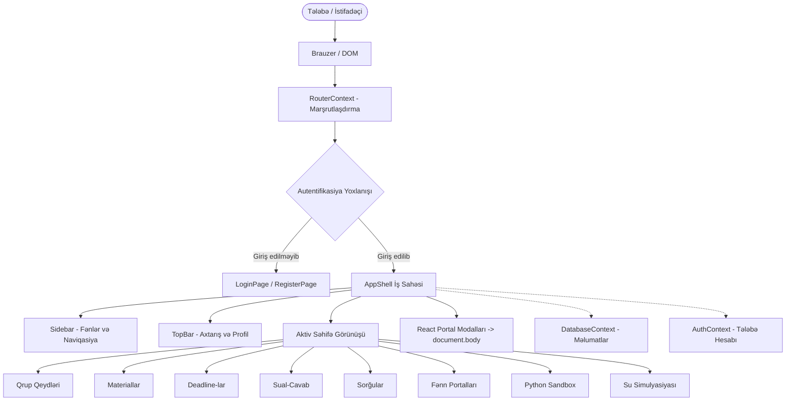

# AzTU 6326A2 — Proqram Təminatı Memarlığı (Architecture Guide)

> **1.16.0 keçid qeydi:** Yeni kodda `AuthContext` yalnız Supabase Auth tərəfindən doğrulanmış sessiya və `profiles.auth_user_id` ilə bağlı 6326A2 profili qəbul edir. `DatabaseProvider` iş sahəsi ilə birlikdə dinamik yüklənir. Üzvlük və sahiblik bazada RLS ilə qorunur; qeydiyyat və köhnə profilin təsdiqlənmiş e-poçt sahibi ilə bağlanması `api/auth.ts` server funksiyasındadır. Bu memarlıq canlı SQL miqrasiyası tətbiq ediləndən sonra işləyir.

Bu sənəd **AzTU 6326A2** akademik iş sahəsinin sistem arxitekturasını, komponent iyerarxiyasını, vəziyyət idarəetməsini (state management), marşrutlaşdırma və dialoq (modal) portal mexanizmini ətraflı izah edir.

---

## 1. Memarlıq Baxışı (High-Level Overview)

Platforma müasir, yüksək performanslı **Client-Side Single Page Application (SPA)** modelində inşa edilmişdir. Hər hansı ağır backend asılılığı olmadan, sürətli və etibarlı şəkildə işləyir:


```mermaid
graph TD
    User([Tələbə / İstifadəçi]) --> Browser[Brauzer / DOM]
    Browser --> Router[RouterContext - Marşrutlaşdırma]
    Router --> AuthGuard{Autentifikasiya Yoxlanışı}
    AuthGuard -- Giriş edilməyib --> AuthPages[LoginPage / RegisterPage]
    AuthGuard -- Giriş edilib --> AppShell[AppShell İş Sahəsi]
    
    AppShell --> Sidebar[Sidebar - Fənlər və Naviqasiya]
    AppShell --> TopBar[TopBar - Axtarış və Profil]
    AppShell --> ActiveView[Aktiv Səhifə Görünüşü]
    
    ActiveView --> NotesView[Qrup Qeydləri]
    ActiveView --> MaterialsView[Materiallar]
    ActiveView --> DeadlinesView[Deadline-lar]
    ActiveView --> QAView[Sual-Cavab]
    ActiveView --> PollsView[Sorğular]
    ActiveView --> CourseView[Fənn Portalları]
    ActiveView --> SandboxView[Python Sandbox]
    ActiveView --> WaterView[Su Simulyasiyası]
    
    AppShell --> Modals[React Portal Modalları -> document.body]
    
    AppShell -.-> DBContext[DatabaseContext - Məlumatlar]
    AppShell -.-> AuthContext[AuthContext - Tələbə Hesabı]
```

---

## 2. Vəziyyət İdarəetməsi (Context Hierarchy)

Layihədə xarici ağır vəziyyət idarəetmə kitabxanaları (məsələn, Redux) əvəzinə React 19-un daxili **Context API** mexanizmi istifadə olunmuşdur. Təminatçılar (`Providers`) ardıcıllığı belədir:

```tsx
<RouterProvider>
  <AuthProvider>
    <DatabaseProvider>
      <AppContent />
    </DatabaseProvider>
  </AuthProvider>
</RouterProvider>
```

### 2.1. RouterContext (`src/context/RouterContext.tsx`)
- **İş prinsipi**: Brauzerin `window.history.pushState` və `popstate` hadisələrinə əsaslanan xüsusi, yüngül marşrutlaşdırıcı.
- **SPA Rewrites**: Vercel serverində `vercel.json` əvvəl `/api/:path*` funksiyalarını və `/adiak-serbest-is-23` statik təqdimat modulunu qoruyur, qalan SPA marşrutlarını `index.html`-ə yönləndirir.
- **Marşrutlar**:
  - `/` — Əsas təqdimat (Landing) səhifəsi
  - `/adiak-serbest-is-23/index.html` — ADİAK Sərbəst İş №23 interaktiv slayd və ESD simulyatoru (`index.html`, `style.css`, `script.js`)
  - `/login` — Giriş səhifəsi
  - `/register` — Qeydiyyat səhifəsi
  - `/app` — Əsas iş lövhəsi (Dashboard)
  - `/app/notes` — Qrup qeydləri
  - `/app/qa` — Sual-cavab forumu
  - `/app/polls` — Sorğular
  - `/app/materials` — Materiallar
  - `/app/deadlines` — Tələbə tapşırıq və imtahan tarixləri
  - `/app/sandbox` — Python icra mühiti
  - `/app/water` — Su dalğaları üzrə interaktiv fizika laboratoriyası
  - `/app/courses/:slug` — Fənn portalları (`math-analysis`, `physics`, `programming`, `english`)

### 2.2. AuthContext (`src/context/AuthContext.tsx`)
- **Məsuliyyəti**: Tələbə autentifikasiyası, 30 nəfərlik kvota nəzarəti, təhlükəsizlik kodu və tələbə profilinin idarə edilməsi.
- **Giriş mənbəyi**: Supabase Auth sessiyası və həmin hesabın `profiles.auth_user_id` əlaqəsi. Köhnə SHA-256 heşi giriş üçün istifadə olunmur; profil yalnız təsdiqlənmiş e-poçt sahibinə bağlanır.
- **Şəxsiyyət Bloklaması (Locked Identity)**: Tələbənin `firstName`, `lastName` və `group` dəyərləri proqram səviyyəsində dəyişdirilməz (immutable) saxlanılır.
- **Google GIS İnteqrasiyası**: `loginWithGoogle` Google ID tokenini Supabase Auth-a göndərir; profil serverdə doğrulanmış Google istifadəçisi üçün bağlanır.

### 2.3. DatabaseContext (`src/context/DatabaseContext.tsx`)
- **Məsuliyyəti**: Fənlər, qeydlər, sual-cavablar, sorğular, materiallar və deadline-ların vahid CRUD əməliyyatları.
- **Davamlılıq (Persistence)**: Paylaşımlar Supabase-də saxlanır; brauzer yaddaşı oflayn nüsxədir. Giriş sessiyası üçün yerli hesab siyahısı istifadə olunmur.
- **İlkin verilənlər (Seeding)**: Altı fənnin statik məzmunu və oflayn nüsxə yerli xidmətlərdən oxunur.
- **Paylaşım Müzakirəsi**: Qeyd/materiala aid müzakirə mövcud `questions` və `answers` cədvəllərində deterministik mövzu ID-si ilə saxlanır. Qəbul edilmiş qeyd düzəlişləri əlavə cavab kimi tarixçəyə yazılır; ilkin mətn qorunur.
- **ID uyğunluğu**: Yeni material, qeyd, sual və cavabın bir ID-si həm yerli saxlamaya, həm bulud yazısına ötürülür.

---

## 3. Komponentlər və Dizayn Sistemi

Platformanın vizual tərzi **Linear** və **21st.dev** dizayn dillərindən ilhamlanmışdır:

### 3.1. Qlobal Dizayn Tokenləri (`src/styles/global.css`)
- **Rənglər**: Təmiz qara-ağ kontrastı, dəqiq tündləşdirilmiş səthlər və vurğu rəngləri:
  - `--bg-app`: `#fafafa`
  - `--bg-surface`: `#ffffff`
  - `--border-default`: `#e2e8f0`
  - `--text-primary`: `#0f172a`
  - `--text-muted`: `#64748b`
- **Şriftlər**: Müasir sans-serif və monospaced şrift iyerarxiyası (`Inter`, `-apple-system`, `JetBrains Mono`).

### 3.2. AppShell Sxemi (`src/components/app/AppShell.tsx`)
İş sahəsi iki əsas zonaya bölünür:
1. **Sidebar (`Sidebar.tsx`)**:
   - Masaüstü: `width: 240px; position: sticky; top: 0; height: 100vh;`.
   - Mobil (<= 768px): Sol tərəfdən açılan gizli çekməce (drawer), qaranlıq örtük və bağlama düyməsi.
2. **Viewport (`workspace-viewport`)**:
   - **TopBar (`TopBar.tsx`)**: Səhifə başlığı, axtarış paneli, mobil menyu açarı və tələbə avatar düyməsi.
   - **Məzmun Sahəsi (`workspace-content-body`)**: Scroll oluna bilən əsas səhifə görünüşü.

---

## 4. Dialoq və Modal Portal Memarlığı (React Portal Fix)

Modalların (Qeyd əlavə et, Profil, Sual ver və s.) nümayişində ən kritik məqam onların **React Portal** vasitəsilə birbaşa `document.body`-yə bağlanmasıdır.

### 4.1. Niyə React Portal Lazımdır?
CSS standartına görə, əgər hər hansı bir valideyn elementində `transform` (məsələn, səhifə açılış animasiyası `animation: viewFadeIn forwards`), `filter` və ya `perspective` varsa, onun daxilindəki `position: fixed` elementlər brauzer pəncərəsinə yox, həmin valideyn konteynerə məhdudlaşır.

Əvvəlki versiyada bu problem səbəbindən:
- Modalın arxa fonu yalnız ortadakı 1080px-lik bloku örtürdü.
- Ekran hündürlüyü kiçik olduqda modalın başlığı və `X` bağlama düyməsi yuxarıdan kəsilirdi.

### 4.2. Həll Sxemi
[`Modal.tsx`](file:///c:/Users/Tech%20Evo%20Computers/Desktop/Layihələr/AzTu/src/components/common/Modal.tsx) və [`ProfileModal.tsx`](file:///c:/Users/Tech%20Evo%20Computers/Desktop/Layihələr/AzTu/src/components/app/modals/ProfileModal.tsx):
```tsx
import { createPortal } from 'react-dom';

export const Modal: React.FC<ModalProps> = ({ isOpen, onClose, title, children }) => {
  if (!isOpen) return null;

  return createPortal(
    <div className="modal-backdrop-layer" onClick={onClose} aria-modal="true" role="dialog">
      <div className="modal-window-card" onClick={(e) => e.stopPropagation()}>
        <div className="modal-top-bar">
          <h3>{title}</h3>
          <button onClick={onClose}><X size={15} /></button>
        </div>
        <div className="modal-body-content">{children}</div>
      </div>
    </div>,
    document.body // Birbaşa body-yə mount olunur
  );
};
```

### 4.3. Təhlükəsiz Mərkəzləmə CSS Qaydası
`align-items: center` əvəzinə `margin: auto` tətbiq olunmuşdur. Əgər ekran hündürlüyü modalın ölçüsündən kiçik olarsa, `margin: auto` kartı mənfi koordinatlara itələmir və başlıq heç vaxt kəsilmir:
```css
.modal-window-card {
  width: 100%;
  max-height: calc(100vh - 3rem);
  margin: auto;
  display: flex;
  flex-direction: column;
}

.modal-top-bar {
  flex-shrink: 0;
}

.modal-body-content {
  flex: 1;
  overflow-y: auto;
  min-height: 0;
}
```

---

## 5. Python Sandbox Memarlığı

Platforma daxilindəki Python icra mühiti (`PythonSandboxView.tsx`) tələbələrin proqramlaşdırma laboratoriyalarını birbaşa brauzerdə test etməsi üçün nəzərdə tutulmuşdur:
- Kod redaktoru və xəta çıxış paneli.
- Standart riyazi və alqoritmik Python skriptlərinin dərhal icrası.
- Tələbənin yazdığı kodların lokal saxlanılması və sıfırlanması.

---

## 6. Xülasə

Riyazi analiz portalı `CourseShellView` daxilində birbaşa dərs siyahısı ilə açılır. `MathLearningView` mühazirəni seçdirir və həmin mühazirənin qaydalar, praktika, laboratoriya və AI bölmələrini göstərir. Bölmələr görünüş dəyişəndə mount vəziyyətini saxlayır; test cavabları itmir. `MathPractice` testləri, `MathProofChallenge` isbat məşqini, `MathLessonLab` isə mühazirə ID-sinə uyğun olan üç klient laboratoriyasından birini göstərir. `AppShell` fənn slug-u dəyişəndə `CourseShellView`-u yenidən mount edir ki, yeni fənn öz ilkin tabı ilə açılsın. `MathTutorChat` seçilmiş mühazirə ID-sini və son dörd mesajı `/api/lecture-chat` funksiyasına göndərir; son 20 mesaj yalnız tabın `sessionStorage` yaddaşında saxlanır. Funksiya mühazirə məzmununu serverdə ID üzrə seçir, Gemini açarını `GEMINI_API_KEY` server mühitindən oxuyur və sorğu ölçüsü ilə sürətini məhdudlaşdırır. Klientə API açarı ötürülmür.

Fizika portalı `CourseShellView` daxilində `PhysicsLearningView` ilə açılır. LMS mövzu/laboratoriya sırası və ilkin məlumatlar `src/data/physicsContent.ts`, geniş mühazirə mətni `physicsLessonDetails.ts`, laboratoriya nəzəriyyəsi və hesablamaları `physicsLabDetails.ts` statik fayllarındadır. Komponent mövzu və laboratoriya seçimini yalnız React vəziyyətində saxlayır; yeni server çağırışı və yaddaş sxemi yoxdur. Müəllim təqdimatı olmayan 5–8-ci mövzularda LMS planına əsaslanan müstəqil bələdçi müəllim materialından fərqləndirilir. LMS siyahısından kənar nixrom təlimatı ayrıca göstərilir.

Fizika üçün `CourseShellView` ilkin ekranda üç əsas keçid göstərir: Dərslər, Qrup, Fənn haqqında. Qrup keçidinin içindən mövcud material, qeyd, tapşırıq və sual görünüşlərinə gedilir; həmin CRUD axınları dəyişmir. `PhysicsLearningView` siyahıda yalnız nömrə və başlıq göstərir, mövzunun planı və mənbəsi isə HTML `details` ilə açılır. Bu sadələşdirmə yeni məlumat modeli yaratmır.

Müəllim sənədləri və fənn konspektləri PDF formatında Novcept-in Cloudflare R2 bucket-ində (`pub-40bab608394d42c2883a3de1b69e3d1f.r2.dev/aztu/{physics,math,algebra,programming,adiak,english}/`) saxlanır (cəmi 33 PDF). Həm `CourseShellView`, həm `MaterialsView`, həm `MathLearningView`, həm də `PhysicsLearningView` daxilində mövzular `StudyNotesList` (`src/components/app/StudyNoteCard.tsx`) komponenti vasitəsilə 7 pedaqoji blokda (`intuition`, `body`, `formulaOrCode`, `symbols`, `steps`, `example`, `warning`) render olunur, PDF faylları isə `PhysicsPdfViewer` vasitəsilə səhifədən çıxmadan canvas üzərində göstərilir.

AzTU 6326A2 memarlığı yüksək etibarlılıq, tələbə məlumatlarının tam qorunması, istənilən cihazda (mobil, planşet, noutbuk) qüsursuz işləməsi və sıfır xəta prinsipləri üzərində qurulmuşdur.
