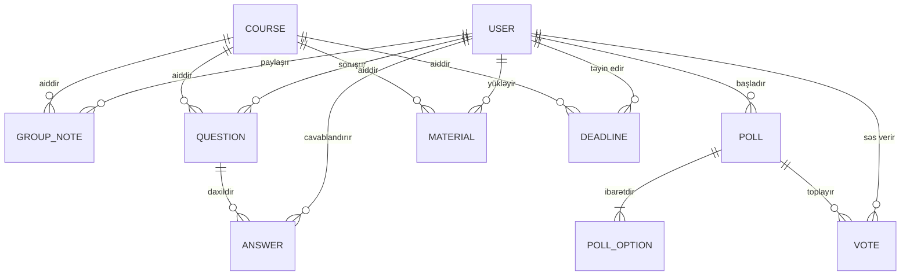

# AzTU 6326A2 — Verilənlər Modelləri və Sxemlər (Data Models & Schemas)

Bu sənəd **AzTU 6326A2 Vahid Akademik İş Sahəsi** platformasındakı bütün verilənlər strukturlarını, TypeScript interfeyslərini, sahə tələblərini və `localStorage` yaddaş açarlarını əhatə edir.

---

## 1. Yaddaş Açarları (Storage Keys)

Bütün verilənlər brauzerin yerli yaddaşında xüsusi prefikslərlə təhlükəsiz şəkildə saxlanılır:

| Yaddaş Açarı (Key) | Növü | Təsviri |
| :--- | :--- | :--- |
| `aztu_6326a2_session` | `User` | Cari aktiv sessiyada daxil olmuş tələbənin profili |
| `aztu_6326a2_users` | `StoredAccount[]` | Qeydiyyatdan keçmiş bütün tələbələrin siyahısı (maksimum 30) |
| `aztu_6326a2_courses` | `Course[]` | Akademik fənlərin siyahısı və kreditləri |
| `aztu_6326a2_notes` | `GroupNote[]` | Qrup mühazirə və müəllim qeydləri |
| `aztu_6326a2_questions` | `Question[]` | Sual-Cavab forumundakı suallar |
| `aztu_6326a2_answers` | `Answer[]` | Suallara verilən cavablar |
| `aztu_6326a2_polls` | `Poll[]` | Qrupdaxili aktiv və tamamlanmış sorğular |
| `aztu_6326a2_votes` | `Vote[]` | Sorğularda verilmiş tələbə səsləri |
| `aztu_6326a2_materials` | `Material[]` | Yüklənmiş dərs materialları və təqdimatlar |
| `aztu_6326a2_deadlines` | `Deadline[]` | Kolloqvium və tapşırıq tarixləri |
| `aztu_6326a2_bookmarks_<userId>` | `string[]` | Hər tələbənin bu brauzerdə saxladığı qeyd, material və sual ID-ləri |
| `aztu_search_focus` | `{kind,id}` | Axtarış nəticəsindən paylaşım kartına bir dəfəlik keçid |
| `aztu_sandbox_shared_code` | `string` | Sual-cavabdakı Python kodunu Sandbox-a bir dəfəlik ötürmə |

---

## 2. İstifadəçi və Profil Modelləri

### 2.1. `User` (Tələbə İdentikliyi)
```typescript
export interface User {
  id: string;                 // Unikal tələbə identifikatoru (məs: 'usr_6326a2_...')
  firstName: string;          // LOCKED: Dəyişdirilə bilməz, universitet qeydiyyatı ilə təsdiqlənir
  lastName: string;           // LOCKED: Dəyişdirilə bilməz, universitet qeydiyyatı ilə təsdiqlənir
  email: string;              // Universitet və ya Google e-poçt ünvanı
  group: string;              // LOCKED: Həmişə '6326A2'
  avatarInitials: string;     // Ad və soyadın baş hərfləri (məs: 'EN')
  avatarUrl?: string;         // Profil şəkli (Base64 data URI, HTTP URL və ya Emoji)
  bio?: string;               // Fərdi tələbə statusu / bioqrafiya
  studentIdNumber?: string;   // Tələbə bilet / kart nömrəsi
  specialty?: string;         // Təhsil aldığı ixtisas (məs: 'Kompüter Mühəndisliyi')
  telegram?: string;          // Telegram istifadəçi adı (məs: '@elcan_dev')
  phone?: string;             // Əlaqə nömrəsi
  github?: string;            // GitHub profil linki
  createdAt: string;          // Qeydiyyat tarixi (ISO 8601)
  authProvider?: 'password' | 'google'; // Autentifikasiya metodu
}
```

### 2.2. `StoredAccount`
```typescript
interface StoredAccount {
  user: User;
  passwordHash?: string;      // Web Crypto SHA-256 + Salt heşi (yalnız e-poçt/şifrə hesabı üçün)
}
```

### 2.3. `ProfileUpdateData`
Tələbə tərəfindən profil modalında redaktə edilə bilən fərdi sahələr:
```typescript
export interface ProfileUpdateData {
  avatarUrl?: string;
  bio?: string;
  studentIdNumber?: string;
  specialty?: string;
  telegram?: string;
  phone?: string;
  github?: string;
}
```

---

## 3. Fənn Modeli (`Course`)

```typescript
export interface Course {
  id: string;                 // Fənn ID-si (məs: 'math-analysis')
  code: string;               // Fənn kodu (məs: 'MATH-101')
  name: string;               // Rəsmi adı (məs: 'Riyazi analiz')
  slug: string;               // URL üçün slug (məs: 'math-analysis')
  lecturer: string;           // Mühazirəçi müəllimin adı
  department: string;         // Kafedra (məs: 'Kompüter Mühəndisliyi')
  credits: number;            // Kredit sayı (məs: 6)
}
```

---

## 4. Qrup Qeydləri Modeli (`GroupNote`)

```typescript
export type NoteCategory = 'teacher_said' | 'exam_colloquium' | 'seminar' | 'general';

export interface GroupNote {
  id: string;                 // Unikal qeyd ID-si
  courseId: string;           // Əlaqəli fənn ID-si
  content: string;            // Qeydin əsas mətni
  category: NoteCategory;     // 'teacher_said' | 'exam_colloquium' | 'seminar' | 'general'
  authorId: string;           // Qeydi yazan tələbənin ID-si
  authorName: string;         // Qeydi yazan tələbənin Adı və Soyadı
  createdAt: string;          // Yaradılma vaxtı (ISO 8601)
  updatedAt?: string;         // Son yenilənmə vaxtı
}
```

---

## 5. Sual-Cavab Forumu Modelləri (`Question` və `Answer`)

### 5.1. `Question`
```typescript
export interface Question {
  id: string;                 // Unikal sual ID-si
  title: string;              // Sualın başlığı
  details?: string;           // Ətraflı izahat və ya kod
  courseId: string;           // Aid olduğu fənn
  acceptedAnswerId?: string;  // Təsdiqlənmiş doğru cavabın ID-si
  authorId: string;           // Sualı verən tələbə
  authorName: string;         // Tələbənin adı
  createdAt: string;          // Tarix
  updatedAt?: string;
}
```

### 5.2. `Answer`
```typescript
export interface Answer {
  id: string;                 // Cavab ID-si
  questionId: string;         // Aid olduğu sualın ID-si
  content: string;            // Cavab mətni
  isAccepted: boolean;        // Doğru cavab kimi seçilibmi?
  authorId: string;           // Cavab yazan tələbə
  authorName: string;
  createdAt: string;
}
```

### 5.3. Paylaşım müzakirələri və qeyd düzəlişləri
Müzakirə yeni baza cədvəli yaratmadan mövcud `Question`/`Answer` modelləri ilə saxlanır. Müzakirə sualının ID-si `discussion_<note|material>_<targetId>` formatındadır və `details` sahəsi `__aztu_discussion__:` prefiksi ilə başlayır. Belə suallar adi Q&A siyahısından gizlədilir. Cavab mətnində `__aztu_suggestion__` prefiksi düzəliş təklifini, `__aztu_revision__` prefiksi qəbul edilmiş versiyanı göstərir. Qeydin ilkin mətni dəyişdirilmir; göstərilən cari mətn son qəbul edilmiş versiyadan götürülür.

---

## 6. Qrup Sorğuları Modelləri (`Poll` və `Vote`)

### 6.1. `PollOption` & `Poll`
```typescript
export interface PollOption {
  id: string;                 // Variant ID-si
  text: string;               // Variant mətni
}

export interface Poll {
  id: string;                 // Sorğu ID-si
  question: string;           // Sorğu sualı
  courseId?: string;          // İstəyə bağlı aid olduğu fənn
  options: PollOption[];      // Variantlar siyahısı
  authorId: string;           // Sorğunu başladan tələbə
  authorName: string;
  createdAt: string;
  isClosed?: boolean;         // Səsvermə dayandırılıbmı?
}
```

### 6.2. `Vote`
```typescript
export interface Vote {
  id: string;                 // Səs ID-si
  pollId: string;             // Aid olduğu sorğu
  optionId: string;           // Seçilən variant
  userId: string;             // Səs verən tələbə (təkrar səsvermənin qarşısını almaq üçün)
  createdAt: string;
}
```

---

## 7. Akademik Materiallar Modeli (`Material`)

```typescript
export interface Material {
  id: string;                 // Material ID-si
  title: string;              // Faylın və ya keçidin adı
  courseId: string;           // Fənn ID-si
  type: 'file' | 'link';      // Fayl və ya Xarici Resurs linki
  description?: string;       // Qısa təsvir
  fileName?: string;          // Orijinal fayl adı (məs: 'lab_1_hesabat.pdf')
  fileSize?: string;          // Faylın ölçüsü (məs: '2.4 MB')
  fileMime?: string;          // MIME tipi (məs: 'application/pdf')
  linkUrl?: string;           // Xarici keçid URL-i
  authorId: string;           // Paylaşan tələbə
  authorName: string;
  createdAt: string;
  updatedAt?: string;
}
```

---

## 8. Deadline və Tapşırıqlar Modeli (`Deadline`)

```typescript
export interface Deadline {
  id: string;                 // Deadline ID-si
  title: string;              // Tapşırığın adı (məs: 'Laboratoriya işi №3')
  courseId: string;           // Fənn ID-si
  description?: string;       // Tələblər və izahat
  dueDate: string;            // Son tarix (YYYY-MM-DD formatında)
  dueTime?: string;           // Son saat (HH:mm formatında)
  points?: number;            // Tapşırığın bal dəyəri (məs: 10 bal)
  isCompleted?: boolean;      // Bitirilibmi?
  authorId: string;           // Yaradan tələbə
  authorName: string;
  createdAt: string;
  updatedAt?: string;
}
```

---

## 9. Münasibətlər (Entity Relationships)



---

## 10. Canlı Supabase PostgreSQL Bulud Sxemi (Cloud Persistence)

Layihə canlı Supabase PostgreSQL layihəsinə (`wcjdduxtssltkjkslyit`) bağlıdır. Cədvəllər brauzer modelləri ilə 100% uyğunlaşdırılmışdır:

| Cədvəl | İlkin Açar (PK) | Əsas Sahələr | Təhlükəsizlik / Qaydalar |
| :--- | :--- | :--- | :--- |
| `profiles` | `id (UUID)` | `first_name, last_name, email, password_hash, group_name, bio, student_id_number, specialty, telegram, phone, github, avatar_url, avatar_initials, auth_provider` | `check_max_students_limit()` triggeri (Maks 30 tələbə) |
| `courses` | `id (UUID)` | `name, code, slug, lecturer, department, credits` | Universitet fənnləri |
| `notes` | `id (TEXT)` | `course_id, content, category, author_id, author_name, created_at, updated_at` | RLS aktiv, Realtime yayım |
| `questions` | `id (TEXT)` | `title, details, course_id, accepted_answer_id, author_id, author_name, created_at, updated_at` | RLS aktiv, Realtime yayım |
| `answers` | `id (TEXT)` | `question_id (FK), content, is_accepted, author_id, author_name, created_at` | `questions(id)` silindikdə kaskad silinmə |
| `polls` | `id (TEXT)` | `question, course_id, author_id, author_name, is_closed, created_at` | RLS aktiv, Realtime yayım |
| `poll_options`| `id (TEXT)` | `poll_id (FK), text` | `polls(id)` silindikdə kaskad silinmə |
| `poll_votes` | `id (TEXT)` | `poll_id (FK), option_id (FK), user_id, created_at` | `UNIQUE(poll_id, user_id)` (1 tələbə 1 səs) |
| `materials` | `id (TEXT)` | `title, course_id, type, description, file_name, file_size, file_mime, link_url, author_id, author_name, created_at, updated_at` | RLS aktiv, Realtime yayım |
| `deadlines` | `id (TEXT)` | `title, course_id, description, due_date, due_time, points, is_completed, author_id, author_name, created_at, updated_at` | RLS aktiv, Realtime yayım |

### Bulud Fayl Saxlanması (Supabase Storage)
- **Bucket Adı**: `materials` (İctimai / Public)
- **RLS**: Anonim və autentifikasiyalı istifadəçilər fayl yükləyə (`INSERT`), baxa (`SELECT`) və silə (`DELETE`) bilər.
- **İnteqrasiya**: Yüklənən faylların ictimai URL ünvanı avtomatik `materials.link_url` sahəsinə yazılır və 30 tələbənin hamısı üçün ani əlçatan olur.

### Real-vaxt Yayım Kanalı (Realtime Broadcast)
- **Kanal adı**: `public:aztu_realtime_workspace`
- **Tədbir növü**: `postgres_changes (*)`
- **Əhatə etdiyi cədvəllər**: `notes`, `materials`, `deadlines`, `questions`, `answers`, `polls`, `poll_options`, `poll_votes`.
