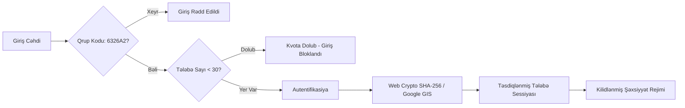

# AzTU 6326A2 — Təhlükəsizlik Siyasəti və Qaydaları (Security Policy)

Bu sənəd **AzTU 6326A2 Vahid Akademik İş Sahəsi** platformasının təhlükəsizlik memarlığını, qoruma mexanizmlərini, 30 nəfərlik kvota baryerini və məxfilik qaydalarını müəyyən edir.

---

## 🛡️ Təhlükəsizlik Prinsipləri

Platforma akademik mühitin tələblərinə uyğun olaraq aşağıdakı əsas təhlükəsizlik sütunları üzərində qurulmuşdur:



---

## 1. 30 Tələbə Kvota Baryeri (`MAX_STUDENTS_LIMIT`)

- **Məqsəd**: Qrup daxili məlumatların (mühazirə qeydləri, imtahan hazırlıqları, daxili sorğular) kənar şəxslər, digər qruplar və ya botlar tərəfindən oxunmasının qarşısını almaq.
- **İkili Müdafiə Səviyyəsi (Dual-Layer Defense)**:
  1. **Brauzer və Müştəri Səviyyəsi (`AuthContext.tsx`)**: Qeydiyyatdan keçmiş hesabların sayı və Supabase `profiles` sayı real-vaxt rejimində yoxlanılır (`MAX_STUDENTS_LIMIT = 30`). Say 30-a çatdıqda qeydiyyat düymələri dərhal bloklanır.
  2. **Verilənlər Bazası Səviyyəsi (PostgreSQL Trigger)**: Canlı Supabase bazasında `BEFORE INSERT` tətikçisi aktivdir. Hər hansı kənar API manipulyasiyası ilə bazaya 31-ci tələbə daxil edilməyə cəhd edilsə belə, PostgreSQL birbaşa xəta qaytararaq əməliyyatı ləğv edir:
  ```sql
  CREATE OR REPLACE FUNCTION check_max_students_limit()
  RETURNS TRIGGER AS $$
  DECLARE
    current_count INTEGER;
  BEGIN
    SELECT COUNT(*) INTO current_count FROM profiles;
    IF current_count >= 30 THEN
      RAISE EXCEPTION 'AzTU 6326A2 XƏTASI: Qrupda maksimum 30 nəfərlik kvota dolmuşdur!';
    END IF;
    RETURN NEW;
  END;
  $$ LANGUAGE plpgsql;

  CREATE TRIGGER enforce_30_students_limit
  BEFORE INSERT ON profiles
  FOR EACH ROW
  EXECUTE FUNCTION check_max_students_limit();
  ```
- **Davranış**:
  - Həm ənənəvi qeydiyyat formu (`RegisterPage.tsx`), həm də Google ilə yeni hesab yaratma cəhdi 30 nəfərdən sonra dərhal rədd edilir:
    > *"6326A2 qrupu üçün ayrılmış 30 nəfərlik qeydiyyat limiti tamamlanmışdır. Kənar şəxslərin daxil olmasına icazə verilmir."*

---

## 2. Qrup Təhlükəsizlik Kodu (`GROUP_SECURITY_CODE`)

- **Qrup Kodu**: `6326A2`
- **Tələb**:
  - Hər bir yeni tələbə qeydiyyatdan keçərkən və ya ilk dəfə Google hesabı ilə daxil olduqda bu kodu daxil etməyə məcburdur.
  - Yanlış və ya boş buraxılmış kod halında hesab yaradılmır və sessiya açılmır.

---

## 3. Kriptoqrafik Şifrə Təhlükəsizliyi

Platformada heç bir şifrə açıq mətn (plain-text) şəklində saxlanılmır:
- **Alqoritm**: W3C standartı olan **Web Crypto API** (`crypto.subtle.digest('SHA-256', ...)`).
- **Duzlama (Salting)**: Şifrələrə heşlənmədən əvvəl unikal qrup duzu (`6326A2_WORKSPACE_SECURE_SALT_v1`) əlavə olunur:
  ```typescript
  async function hashPassword(password: string): Promise<string> {
    const encoder = new TextEncoder();
    const data = encoder.encode(password + SALT);
    const hashBuffer = await crypto.subtle.digest('SHA-256', data);
    const hashArray = Array.from(new Uint8Array(hashBuffer));
    return hashArray.map((b) => b.toString(16).padStart(2, '0')).join('');
  }
  ```
- Bu yanaşma Rainbow Table və lüğət hücumlarına qarşı etibarlı qoruma təmin edir.

---

## 4. Dəyişdirilməz Tələbə Şəxsiyyəti (Immutable Identity)

- Tələbə platformaya qeydiyyatdan keçdikdən sonra onun **Adı**, **Soyadı** və **Qrup nömrəsi** dondurulur:
  - Tələbə profil redaktə pəncərəsində (`ProfileModal.tsx`) ad və soyad sahələri `disabled` rejimində göstərilir və `Lock` nişanı ilə təchiz olunur.
  - Profil yeniləmə funksiyası (`updateProfile`) yalnız əlavə məlumatları (avatar, bio, ixtisas, əlaqə linkləri) qəbul edir. Tələbənin rəsmi adını dəyişmək üçün ötürülən cəhdlər proqram təminatı səviyyəsində rədd edilir.
- Bu qayda qrup daxilində başqa şəxsin adından qeyd yazılmasının və anonim təxribatların qarşısını 100% alır.

---

## 5. Google Identity Services (GIS) OAuth 2.0 Təhlükəsizliyi

- **Client ID Təhlükəsizliyi**: Google OAuth Client ID yalnız rəsmi domenlər üçün təsdiqlənmişdir (`https://aztu-ebon.vercel.app` və lokal inkişaf mühiti `http://localhost:5173`).
- **Token Doğrulaması**: Google tərəfindən verilən JWT `credential` tokeni klient tərəfdə təhlükəsiz şəkildə parse olunur və yalnız etibarlı Google istifadəçi identifikatoru (`sub`), e-poçt və ad qəbul edilir.

---

## 6. Marşrut Qoruması və XSS Mühafizəsi

- **Marşrut Qoruyucuları (Route Guards)**: `/app` və onun bütün alt səhifələri (`/app/notes`, `/app/materials` və s.) yalnız `isAuthenticated === true` olduqda açılır. Əks halda brauzer avtomatik `/login` səhifəsinə yönləndirilir.
- **XSS (Cross-Site Scripting)**:
  - Bütün istifadəçi daxiletmələri (qeydlər, suallar, şərhlər) React-in standart JSX eskapinq mexanizmi ilə təmizlənir.
  - Kod bazasında `dangerouslySetInnerHTML` funksiyasından qətiyyən istifadə olunmur.

---

## 7. Xətaların və Boşluqların Bildirilməsi

Əgər platformada hər hansı təhlükəsizlik xətası və ya uyğunsuzluq aşkar edərsinizsə, lütfən dərhal qrup nümayəndəsinə və ya layihə administratoruna bildirin:

- **E-poçt**: `elcan.nacafov@aztu.edu.az`
- **GitHub Issues**: [https://github.com/elcann7/aztu/issues](https://github.com/elcann7/aztu/issues)
