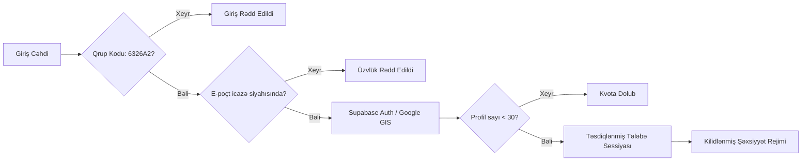

# AzTU 6326A2 — Təhlükəsizlik Siyasəti və Qaydaları (Security Policy)

> **2026-09-28 keçid vəziyyəti:** Repozitoriyada Supabase Auth sessiyası, profilə bağlı RLS, server qeydiyyatı, paralel qeydiyyatda atomik 30 nəfərlik kvota və özəl Storage üçün miqrasiya hazırlanıb. Canlı AzTU layihəsində şəkilli profil saxlanılıb, digər 4 profil və 3 köhnə Auth hesabı istifadəçinin göstərişi ilə silinib. `legacy_rpc_hardening` miqrasiyası iki imtiyazlı funksiyanın birbaşa çağırışını bağlayıb; icazə yoxlaması bunu təsdiqləyib. Köhnə Auth trigger-i və açıq RLS siyasətləri hələ canlıdır; əsas miqrasiya və allow/deny testləri tətbiq/təsdiq edilməyib. Aşağıdakı əvvəlki klient əsaslı təsvirlər cari istehsalatın təhlükəsizlik zəmanəti sayılmır.

Bu sənəd **AzTU 6326A2 Vahid Akademik İş Sahəsi** platformasının təhlükəsizlik memarlığını, qoruma mexanizmlərini, 30 nəfərlik kvota baryerini və məxfilik qaydalarını müəyyən edir.

> **2026-09-23 tarixi tapıntı:** Əvvəlki sürümdə Google JWT yalnız klientdə oxunurdu və `anon` RLS siyasətləri geniş giriş verirdi. 1.16.0 kodu bu axınları dəyişir; canlı bazaya miqrasiya tətbiq edilənədək tapıntı canlı mühit üçün açıq sayılır.

> **Açar keçidi:** Legacy `service_role` açarı söhbətdə paylaşılıb və məxfi sayılmır. İstifadəçinin açıq göstərişi ilə həmin açar müvəqqəti olaraq yalnız Vercel serverindəki `SUPABASE_SECRET_KEY` dəyişənində saxlanır. Onu yeni, ayrıca ləğv edilə bilən `sb_secret_...` açarı ilə əvəz edib legacy açarı deaktiv etmək lazımdır; heç bir gizli açar repozitoriyaya və ya `VITE_` dəyişəninə yazılmamalıdır.

> **AI əlavə qeydi:** `GEMINI_API_KEY` yalnız Vercel server funksiyasında oxunur. 1.16.0 `/api/lecture-chat` funksiyası Supabase Auth tokenini və qrup profilini serverdə yoxlayır, mühazirə ID-sini təsdiqləyir, mətn və tarixçə ölçüsünü məhdudlaşdırır, hər instansiya üçün IP əsaslı qısa müddətli limit tətbiq edir. Bu nəzarət yalnız yeni API yerləşdirildikdən sonra canlıdır.

> **Fizika PDF-ləri:** Müəllim təqdimatı və laboratoriya PDF-ləri Novcept-in mövcud Cloudflare R2 bucket-ində `aztu/physics/` altında ictimai CDN linkləri ilə saxlanır. Tətbiqin giriş ekranı birbaşa URL ilə açan şəxsi server səviyyəsində yoxlamır. Qrupdan kənara çıxmaması tələb olunarsa ayrıca server autentifikasiyası və məxfi fayl saxlama mexanizmi qurulmalıdır.

---

## 🛡️ Təhlükəsizlik Prinsipləri

Platforma akademik mühitin tələblərinə uyğun olaraq aşağıdakı əsas təhlükəsizlik sütunları üzərində qurulmuşdur:


```mermaid
graph LR
    A[Giriş Cəhdi] --> B{Qrup Kodu: 6326A2?}
    B -- Xeyr --> Block1[Giriş Rədd Edildi]
    B -- Bəli --> C{E-poçt icazə siyahısında?}
    C -- Xeyr --> Block2[Üzvlük Rədd Edildi]
    C -- Bəli --> D[Supabase Auth / Google GIS]
    D --> E{Profil sayı < 30?}
    E -- Xeyr --> Block3[Kvota Dolub]
    E -- Bəli --> F[Təsdiqlənmiş Tələbə Sessiyası]
    F --> G[Kilidlənmiş Şəxsiyyət Rejimi]
```

---

## 1. 30 Tələbə Kvota Baryeri (`MAX_STUDENTS_LIMIT`)

- **Məqsəd**: Qrup daxili məlumatların (mühazirə qeydləri, imtahan hazırlıqları, daxili sorğular) kənar şəxslər, digər qruplar və ya botlar tərəfindən oxunmasının qarşısını almaq.
- **İkili Müdafiə Səviyyəsi (Dual-Layer Defense)**:
  1. **Brauzer səviyyəsi (`AuthContext.tsx`)**: `MAX_STUDENTS_LIMIT = 30` göstəricisi serverin qaytardığı profil sayından hesablanır; bu, istifadəçi interfeysi üçündür.
  2. **Server və verilənlər bazası səviyyəsi (keçid miqrasiyası)**: `api/auth.ts` kodu yoxlayır, PostgreSQL `BEFORE INSERT` tətikçisi isə paralel qeydiyyatları kilidləyərək 31-ci profili rədd edir. Bu qayda canlı miqrasiya tətbiq ediləndə qüvvəyə minir.
  ```sql
  CREATE OR REPLACE FUNCTION check_max_students_limit()
  RETURNS TRIGGER AS $$
  DECLARE
    current_count INTEGER;
  BEGIN
    PERFORM pg_advisory_xact_lock(hashtext('aztu_6326a2_profile_quota'));
    SELECT COUNT(*) INTO current_count FROM profiles;
    IF current_count >= 30 THEN
      RAISE EXCEPTION 'AzTU 6326A2 XƏTASI: Qrupda maksimum 30 nəfərlik kvota dolmuşdur!';
    END IF;
    RETURN NEW;
  END;
  $$ LANGUAGE plpgsql;

  CREATE TRIGGER enforce_30_students_limit
  BEFORE INSERT ON profiles
  FOR EACH ROW
  EXECUTE FUNCTION check_max_students_limit();
  ```
- **Davranış**:
  - Həm ənənəvi qeydiyyat formu (`RegisterPage.tsx`), həm də Google ilə yeni hesab yaratma cəhdi 30 nəfərdən sonra dərhal rədd edilir:
    > *"6326A2 qrupu üçün ayrılmış 30 nəfərlik qeydiyyat limiti tamamlanmışdır. Kənar şəxslərin daxil olmasına icazə verilmir."*

---

## 2. Qrup Təhlükəsizlik Kodu (`GROUP_SECURITY_CODE`)

- **Qrup Kodu**: `6326A2`
- **Tələb**:
  - Hər bir yeni tələbə qeydiyyatdan keçərkən və ya ilk dəfə Google hesabı ilə daxil olduqda bu kodu daxil etməyə məcburdur.
  - Yanlış və ya boş buraxılmış kod halında hesab yaradılmır və sessiya açılmır.

---

## 3. Kriptoqrafik Şifrə Təhlükəsizliyi

Platformada heç bir şifrə açıq mətn (plain-text) şəklində saxlanılmır:
- **Yeni hesablar**: Şifrə yoxlamasını Supabase Auth serveri aparır; klientdə şifrə heşi saxlanmır.
- **Köhnə hesablar**: Əvvəlki sabit duzlu SHA-256 heşləri etibarlı giriş sübutu sayılmır. Tələbə e-poçtunu təsdiqləyərək yeni Supabase Auth şifrəsi qurur; server təsdiqli ünvanı köhnə profilə bağlayır. RLS miqrasiyası köhnə heş sütununu brauzerdən gizlədir.
- **Qrup üzvlüyü**: `6326A2` kodu açıq klientdə göründüyü üçün yeni qeydiyyat əlavə olaraq `AZTU_ALLOWED_EMAILS` siyahısına və e-poçt/Google ünvanının doğrulanmasına bağlıdır. Siyahı qurulmayıbsa yeni hesab qəbul edilmir.

---

## 4. Dəyişdirilməz Tələbə Şəxsiyyəti (Immutable Identity)

- Tələbə platformaya qeydiyyatdan keçdikdən sonra onun **Adı**, **Soyadı** və **Qrup nömrəsi** dondurulur:
  - Tələbə profil redaktə pəncərəsində (`ProfileModal.tsx`) ad və soyad sahələri `disabled` rejimində göstərilir və `Lock` nişanı ilə təchiz olunur.
  - Profil yeniləmə funksiyası (`updateProfile`) yalnız əlavə məlumatları (avatar, bio, ixtisas, əlaqə linkləri) qəbul edir. Tələbənin rəsmi adını dəyişmək üçün ötürülən cəhdlər proqram təminatı səviyyəsində rədd edilir.
- 1.16.0 RLS miqrasiyası `first_name`, `last_name` və `group_name` sütunlarına klient yeniləmə icazəsi vermir. Paylaşım müəllifinin ID-si üzvlük qaydası ilə, göstərilən adı isə triggerlə təsdiqlənir. Canlı tətbiq bu qaydaların miqrasiyasını gözləyir.

---

## 5. Google Identity Services (GIS) OAuth 2.0 Təhlükəsizliyi

- **Client ID Təhlükəsizliyi**: Google OAuth Client ID yalnız rəsmi domenlər üçün təsdiqlənmişdir (`https://aztu-ebon.vercel.app` və lokal inkişaf mühiti `http://localhost:5173`).
- **Token Doğrulaması**: Google ID tokeni Supabase Auth `signInWithIdToken` ilə doğrulanır. Server üzvlük əməliyyatı yalnız doğrulanmış Auth istifadəçisinin Google identifikatorunu qəbul edir; əl ilə e-poçt və ad yazmaq giriş yolu deyil.

---

## 6. Marşrut Qoruması və XSS Mühafizəsi

- **Marşrut Qoruyucuları (Route Guards)**: `/app` və alt səhifələr yalnız doğrulanmış Supabase sessiyası və həmin sessiyaya bağlanan qrup profili olduqda açılır. RLS eyni üzvlüyü birbaşa Data API sorğularında da tələb edir.
- **XSS (Cross-Site Scripting)**:
  - Bütün istifadəçi daxiletmələri (qeydlər, suallar, şərhlər) React-in standart JSX eskapinq mexanizmi ilə təmizlənir.
  - Kod bazasında `dangerouslySetInnerHTML` funksiyasından qətiyyən istifadə olunmur.

---

## 7. Xətaların və Boşluqların Bildirilməsi

Əgər platformada hər hansı təhlükəsizlik xətası və ya uyğunsuzluq aşkar edərsinizsə, lütfən dərhal qrup nümayəndəsinə və ya layihə administratoruna bildirin:

- **E-poçt**: `elcan.nacafov@aztu.edu.az`
- **GitHub Issues**: [https://github.com/elcann7/aztu/issues](https://github.com/elcann7/aztu/issues)
